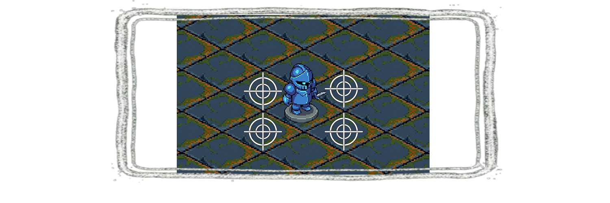

English | [Français](docs/fr/README.md)

# QuoridorGame

A Quoridor-style strategy game with an isometric SFML UI and a heuristic CPU opponent.
Built in C++ (C++20) using SFML for graphics/audio/windowing.

## Table of Contents
- [Overview](#overview)
- [Key Features](#key-features)
- [Installation (Quick Start)](#installation-quick-start)
- [Demo](#demo)
- [Screenshots](#screenshots)
- [Architecture Overview](#architecture-overview)
- [Credits](#credits)
- [License](#license)
- [Contributing](#contributing)
- [Additional Notes](#additional-notes)
- Docs
  - [Build & Run](docs/en/BUILD_RUN.md)
  - [Gameplay & Controls](docs/en/CONTROLS.md)
  - [Project Structure](docs/en/PROJECT_STRUCTURE.md)
  - [File Responsibilities](docs/en/FILE_RESPONSIBILITIES.md)
  - [Heuristic AI](docs/en/HEURISTIC_AI.md)
  - [OOP Concepts Used](docs/en/OOP_CONCEPTS_USED.md)
  - [Code Quality](docs/en/CODE_QUALITY.md)
  - [Project Management](docs/en/PROJECT_MANAGEMENT.md)

## Overview
This project implements a 2-player Quoridor board game on a 9x9 grid. Players race to
reach the opposite side while placing walls to slow the opponent, under the constraint
that a path to the goal must always remain.

The game uses a screen-based UI, isometric rendering, and a CPU opponent based on
heuristic search.

## Key Features
- Quoridor ruleset with legal wall placement enforcement
- Isometric board rendering with mouse hover and wall preview
- Human vs CPU gameplay (CPU computed asynchronously)
- Heuristic AI: alpha-beta search, move ordering, and transposition table
- Distance cache (BFS) for legality checks and evaluation
- HUD showing turn and remaining walls
- Pause and winner menus
- CMake-based build with SFML fetched via FetchContent

## Installation (Quick Start)

Windows (MSVC / Visual Studio):

```powershell
cmake -S . -B build -G "Visual Studio 17 2022" -A x64
cmake --build build --config Release
```

Linux (g++ / clang):

```bash
cmake -S . -B build -DCMAKE_BUILD_TYPE=Release
cmake --build build -j
```

Run:
- Windows: `build/Release/QuoridorGame.exe`
- Linux: `./build/QuoridorGame`

For full prerequisites, debug builds, and troubleshooting, see
[docs/en/BUILD_RUN.md](docs/en/BUILD_RUN.md).

## Demo
Quick try:
1) Build Release (see Installation).
2) Run the executable.
3) From the title/menu screen, choose Single Player or Multiplayer to start a match.

## Screenshots
Screenshots are stored in `docs/media/` (replace these placeholders with real captures if needed):




## Architecture Overview
- The entry point creates `App::Application`, which owns the SFML window and all screens.
- Screens inherit from `App::Screen` and implement event handling, updates, and rendering.
- `GameScreen` orchestrates gameplay using `GameState`, `GameRules`, `Board`, UI components, and the heuristic AI.
- The CPU turn runs asynchronously with `std::async` so rendering stays responsive.

For more detail, see [docs/en/PROJECT_STRUCTURE.md](docs/en/PROJECT_STRUCTURE.md).

## Credits
- Developers:
  - `<DEVELOPER_1>`
  - `<DEVELOPER_2>`
- Music tool:
  - Suno (`<NOTES_ABOUT_TRACKS/USAGE>`)
- Image tool:
  - Gemini (`<NOTES_ABOUT_ASSETS/USAGE>`)

## License
This project is licensed under `<LICENSE_NAME>`. See `LICENSE` for details.

## Contributing
1. Fork the repository
2. Create a feature branch: `git checkout -b feature/my-change`
3. Commit your changes
4. Push to your fork and open a Pull Request

## Additional Notes
Placeholders to replace before publishing:
- `<LINK>`: repository clone URL
- `<CMAKE_MIN_VERSION>`: minimum required CMake version
- `<SFML_VERSION>`: SFML version used by the project
- `<LICENSE_NAME>`: license identifier
- Credits: developer names and asset/tool notes
- Add or replace demo media under `docs/media/`
