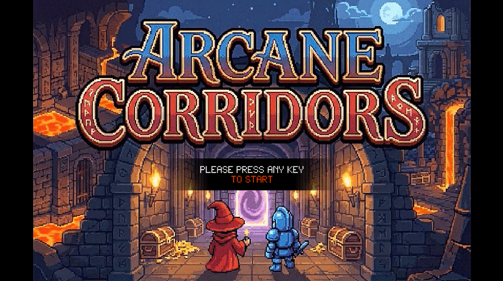

Anglais | [Français](docs/fr/README.md)

# QuoridorGame

Un jeu de strategie de type Quoridor avec une interface SFML isometrique et un adversaire CPU heuristique.
Construit en C++ (C++20) en utilisant SFML pour les graphismes/audio/fenetre.

## Table des matieres
- [Apercu](#overview)
- [Fonctionnalites cles](#key-features)
- [Installation (Demarrage rapide)](#installation-quick-start)
- [Captures d'ecran](#screenshots)
- [Apercu de l'architecture](#architecture-overview)
- [Credits](#credits)
- [Contribuer](#contributing)
- Docs
  - [Compilation et execution](docs/fr/BUILD_RUN.md)
  - [Jouabilite et commandes](docs/fr/CONTROLS.md)
  - [Structure du projet](docs/fr/PROJECT_STRUCTURE.md)
  - [Responsabilites des fichiers](docs/fr/FILE_RESPONSIBILITIES.md)
  - [IA heuristique](docs/fr/HEURISTIC_AI.md)
  - [Concepts OOP utilises](docs/fr/OOP_CONCEPTS_USED.md)
  - [Qualite du code](docs/fr/CODE_QUALITY.md)

## Apercu
Ce projet implemente un jeu Quoridor a 2 joueurs sur une grille 9x9. Les joueurs tentent
d'atteindre le cote oppose tout en placant des murs pour ralentir l'adversaire, sous la contrainte
qu'un chemin vers l'objectif doit toujours rester.

Le jeu utilise une interface basee sur des ecrans, un rendu isometrique, et un adversaire CPU base sur une
recherche heuristique.

## Fonctionnalites cles
- Regles Quoridor avec placement legal des murs
- Rendu isometrique avec survol souris et apercu de mur
- Jeu Humain vs CPU (CPU calcule de facon asynchrone)
- IA heuristique: recherche alpha-beta, ordre des coups, et table de transposition
- Cache de distance (BFS) pour verifications de legalite et evaluation
- HUD affichant le tour et les murs restants
- Menus pause et gagnant
- Build CMake avec SFML recupere via FetchContent

## Installation (Demarrage rapide)

Windows (MSVC / Visual Studio):

```powershell
cmake -S . -B build
cmake --build build
```

Linux (g++ / clang):

```bash
cmake -S . -B build
cmake --build build
```

Executer:
- Windows: `build/Release/QuoridorGame.exe`
- Linux: `./build/QuoridorGame`

Pour les prerequis complets, les builds debug, et le depannage, voir
[docs/fr/BUILD_RUN.md](docs/fr/BUILD_RUN.md).

## Captures d'ecran




## Apercu de l'architecture
- Le point d'entree cree `App::Application`, qui possede la fenetre SFML et tous les ecrans.
- Les ecrans heritent de `App::Screen` et implementent la gestion d'evenements, les mises a jour, et le rendu.
- `GameScreen` orchestre le jeu en utilisant `GameState`, `GameRules`, `Board`, les composants UI, et l'IA heuristique.
- Le tour CPU est lance de facon asynchrone avec `std::async` pour garder un rendu repondant.

Pour plus de details, voir [docs/fr/PROJECT_STRUCTURE.md](docs/fr/PROJECT_STRUCTURE.md).

## Credits
- Developpeurs:
  - CHACON GOMEZ Jose Daniel
  - GitHub: https://github.com/josedanielchg
  - MENESES GAMBOA Carlos Adrian
  - GitHub: https://github.com/MenesesCarlos29
- Musique:
  - Suno (v4.5-all)
  - Pistes utilisees:
    - Castle Circuits (Version 1)
    - Castle Circuits (Version 2)
  - Source: https://suno.com/
  - Pas d'usage commercial
- Art / Images:
  - Gemini (Nano Banana Pro)
  - Source: https://gemini.google.com/
  - Pas d'usage commercial

## Contribuer
1. Forker le depot
2. Creer une branche: `git checkout -b feature/my-change`
3. Commit vos changements
4. Pousser vers votre fork et ouvrir une Pull Request
